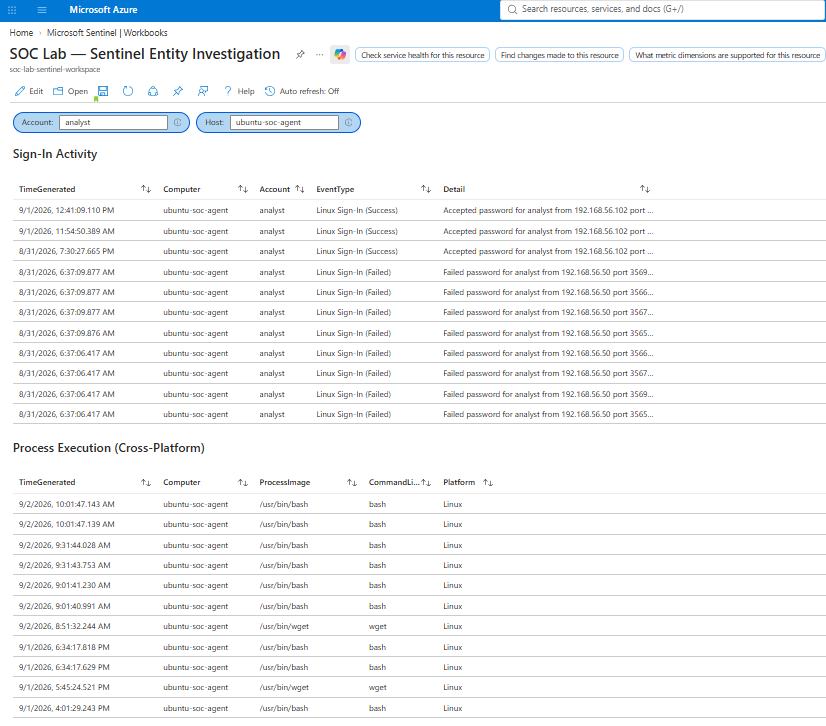
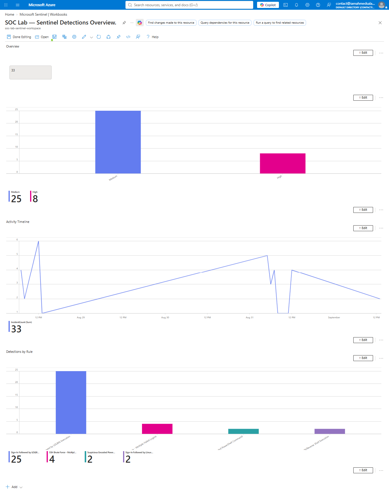

# ☁️ Azure Sentinel SOC Lab

**A hybrid SIEM evaluation project: the same multi-VM home SOC lab, instrumented end-to-end in Microsoft Sentinel, with live side-by-side comparison drills against the existing Wazuh deployment — same attacks, same hosts, real timestamps, real bugs found and fixed on both platforms.**

> Built by [Ahmed Salam](https://iamahmedsalam.com) — AI-Augmented SOC Analyst | CompTIA Security+ | TryHackMe Top 2%
> Companion project to [home-soc-lab](https://github.com/iamahmedsalam/home-soc-lab)

<p align="center">
  
</p>
<p align="center"><em>Entity Investigation workbook, live — the same parameter-driven cross-platform union working against the Linux endpoint, powered by the auditd/Sentinel pipeline built specifically to make this possible</em></p>

<p align="center">
  
</p>
<p align="center"><em>Detections Overview workbook — incident volume, severity breakdown, and rule-level detection activity, live</em></p>

---

## 📋 Project Overview

Most portfolio SIEM projects show one tool in isolation. This project instead takes an existing, already-instrumented Wazuh lab and asks a genuinely interesting question: **what does the same attack surface look like through a cloud-native SIEM, and where do the two tools actually diverge?**

The answer, backed by live evidence rather than assumption: Wazuh detects real-time, locally-tailed events in under a second; Sentinel's scheduled Analytics Rules trade that speed for KQL's native cross-event correlation — and both tools had real detection gaps found and fixed live during this project, not glossed over.

| | |
|---|---|
| **SIEM Platform** | Microsoft Sentinel (Azure) |
| **Comparison Platform** | Wazuh 4.14.4 (see [home-soc-lab](https://github.com/iamahmedsalam/home-soc-lab)) |
| **Endpoints Monitored** | Windows 11 Enterprise + Ubuntu 24.04 LTS (same VMs as home-soc-lab, dual-forwarded) |
| **Attack Platform** | Kali Linux |
| **KQL Analytics Rules** | 7 custom rules, 5 deployed live + 2 mechanics-validated |
| **Live Comparison Drills** | 4 — real attacks, real timestamps, real detection-latency numbers |
| **Workbooks** | 2 — Detections Overview + Entity Investigation (parameter-driven, cross-platform) |
| **Framework** | MITRE ATT&CK v14 |

---

## 💡 What This Project Demonstrates

This isn't a tutorial-follow-along — every piece of it hit a real problem that took genuine diagnostic work to solve, not copy-paste from documentation.

**Real architecture issues, found and diagnosed, not assumed.** Every KQL query initially failed silently against `SecurityEvent` — the table nearly every Sentinel tutorial references — because the modern Azure Monitor Agent never actually populates it. Traced to a real, undocumented distinction between Azure's legacy and modern log-forwarding agents, not a permissions or config error.

**Adversarial self-testing, not a demo.** Every comparison drill deliberately varied the attack tooling from what the detections were originally built and tested against — a different brute-force tool, PowerShell wrapped through `cmd.exe`, a different LOLBIN. Two of those variations found real false negatives in rules that had looked "done."

**Root-cause discipline under pressure.** When Sentinel repeatedly failed to catch a reverse-shell pattern Wazuh caught instantly, the easy conclusion would have been "cloud forwarding is unreliable." Instead, primary-source evidence (Azure Monitor Agent's own diagnostic logs) was pulled and the real cause — a 50-minute authentication token expiry — was found and stated precisely.

**Recognized and closed my own blind spot.** Midway through building an investigation workbook, it became clear the Linux endpoint had *no* process-level detection at all — while Windows had rich Sysmon coverage. Rather than document the gap away, the project's scope was extended: Linux audit infrastructure built from scratch, a new detection pipeline engineered, and validated live — because a portfolio piece that only defends Windows isn't a complete answer for a real SOC.

**An honest comparison, not a sales pitch.** Wazuh detects in real time; Sentinel's scheduled Analytics Rules take minutes but express correlations — like "sign-in followed by suspicious execution, joined across two event types" — that Wazuh's rule engine structurally can't do as cleanly. Both strengths are stated plainly, in both directions, throughout the [drill reports](drills/).

---

## 🏗️ Architecture

```
┌──────────────────────────────────────────────────────────────┐
│              VirtualBox Host-Only Network                    │
│                  192.168.56.0/24                             │
│                                                              │
│  ┌─────────────┐                                             │
│  │ Kali Linux  │                                             │
│  │192.168.56.50│                                             │
│  │  Attack VM  │                                             │
│  └──────┬──────┘                                             │
│         │                                                    │
│  ┌──────┴───────────────┐        ┌─────────────────────┐     │
│  │     Windows 11       │        │  Ubuntu 24.04 LTS   │     │
│  │     192.168.56.103   │        │  192.168.56.104     │     │
│  │     Sysmon v15.15    │        │  auditd + audisp-   │     │
│  │                      │        │  syslog             │     │
│  └──────────┬───────────┘        └──────────┬──────────┘     │
│             │                               │                │
│             ▼                               ▼                │
│      ┌──────────────┐                ┌──────────────┐        │
│      │Wazuh Manager │                │Azure Monitor │        │
│      │192.168.56.101│                │Agent (AMA)   │        │
│      └──────────────┘                └─────────┬────┘        │
└────────────────────────────────────────────────┼─────────────┘
                                                 │
                                                 ▼
                                    ┌──────────────────────┐
                                    │  Microsoft Sentinel  │
                                    │  Log Analytics       │
                                    │  Workspace           │
                                    └──────────────────────┘
```

**Both endpoints dual-forward:** Wazuh agents send to the local Wazuh Manager (real-time); Azure Monitor Agent forwards the same underlying telemetry (Sysmon on Windows, `auditd` via `audisp-syslog` on Linux) to Sentinel's Log Analytics workspace (scheduled Analytics Rules, 5-10 min cadence). This dual-instrumentation is what makes the live comparison drills possible — identical raw data, two independent detection engines.

---

## 🔍 KQL Analytics Rules

7 custom Sentinel rules, each engineered from scratch — full breakdown, including the real bugs found during development, in [`detection-rules/kql-queries-reference.md`](detection-rules/kql-queries-reference.md).

| Query | Detects | MITRE | Status |
|---|---|---|---|
| 1 | SSH brute force (Linux) | T1110.001 | ✅ Deployed |
| 2 | Encoded PowerShell command | T1059.001 | ✅ Deployed |
| 3 | Sign-in → LOLBIN execution (Windows) | T1078, T1059 | ✅ Deployed |
| 4 | Rolling-baseline failed-logon anomaly | T1110 | 🟡 Mechanics validated, deployment pending 7-day history |
| 5 | Statistical process-count anomaly | T1055 | 🟡 Mechanics validated, deployment pending 14-day history |
| 6 | Rare/new process hunting query | T1036 | ✅ Deployed (hunting) |
| 7 | Sign-in → Linux LOLBIN / reverse shell | T1078, T1059, T1105, T1219 | ✅ Deployed |

Queries 4 and 5 are intentionally not forced into production before they have genuine historical data to compare against — see the reference doc for why a "working" query with insufficient baseline data would actually be *worse* than no query at all.

---

## 📊 Workbooks

| Workbook | Purpose |
|---|---|
| [Detections Overview](workbooks/detections-overview.json) | Triage-level dashboard — incident volume, severity breakdown, activity timeline, detections by rule |
| [Entity Investigation](workbooks/entity-investigation.json) | Parameter-driven pivot tool — type in an Account/Host, see cross-platform sign-in and process activity live |

Full design notes in each workbook's companion `-reference.md`.

---

## ⚔️ Live Comparison Drills

Four real attacks, re-run live against both Wazuh and Sentinel simultaneously — not simulated, not run at separate times and compared after the fact.

| Drill | Attack | Wazuh | Sentinel | Real Finding |
|---|---|---|---|---|
| [1](drills/drill-01-ssh-bruteforce.md) | SSH brute force (Medusa) | <1s | ~9m 19s | Real-time vs. scheduled architecture trade-off |
| [2](drills/drill-02-encoded-powershell.md) | Encoded PowerShell via `cmd.exe` | Detected immediately | **False negative found & fixed live** | Sentinel's regex missed the `-enc` abbreviation |
| [3](drills/drill-03-lolbin-execution.md) | `rundll32.exe` LOLBIN | No equivalent rule exists | **Missing binary found & fixed before running** | KQL-native correlation with no Wazuh counterpart |
| [4](drills/drill-04-linux-lolbin.md) | Linux `bash`/`nc`/reverse shell | Detected live (new infra built) | **Two real bugs found & fixed live** | Full Linux telemetry pipeline built from scratch |

Each drill report includes exact UTC timestamps, raw evidence, root-cause analysis for every bug found, and an honest statement of each tool's advantage — not a one-sided comparison.

---

## 🔑 Key Technical Findings

**Architecture:**
- Azure's legacy `SecurityEvent` table is never populated by the modern Azure Monitor Agent — Windows Security events route through the generic `Event` table instead. A real, undocumented-in-most-tutorials distinction between the legacy (MMA) and modern (AMA) agent generations.
- `EventCategory` and `EventID` are separate fields that coincidentally aligned for Sysmon but diverge for native Windows Security events — `EventID` is the correct universal field.
- KQL's `has` operator is token-based and fails silently on unbroken/hex-encoded strings; `contains` performs genuine substring matching. Found the hard way during Drill 4.

**Detection Engineering:**
- Two real Sentinel rule bugs found by deliberately varying attack tooling from what the rules were originally tested against — not accepting a first clean pass as proof of robustness.
- `auditd` hex-encodes `EXECVE` arguments containing shell metacharacters — meaning a plain-text search for `/dev/tcp` misses real reverse-shell one-liners entirely unless the hex-encoded form is also matched.

**Infrastructure:**
- Linux process-level telemetry (`auditd` execve auditing) was built and forwarded to Sentinel by riding an *existing* syslog facility already in use for SSH auth events — no new Azure infrastructure required.
- A ~50-minute Azure Monitor Agent authentication token expiry was diagnosed with primary-source evidence (`mdsd.err` logs) rather than assumed as a generic "tool limitation" — the difference between a real root cause and a plausible-sounding guess.

---

## 🛠️ Technologies Used

| Category | Technology |
|---|---|
| Cloud SIEM | Microsoft Sentinel |
| Query Language | KQL (Kusto Query Language) |
| Log Ingestion | Azure Monitor Agent (AMA), Data Collection Rules |
| Linux Auditing | auditd + audispd-plugins (audisp-syslog) |
| Endpoint Detection | Sysmon v15.15 (shared with home-soc-lab) |
| Comparison SIEM | Wazuh 4.14.4 (see [home-soc-lab](https://github.com/iamahmedsalam/home-soc-lab)) |
| Deployment | Azure CLI (`az rest`) via Cloud Shell — Analytics Rules deployed as infrastructure-as-code, not portal clicks |
| Framework | MITRE ATT&CK v14 |

---

## 🗺️ Project Phases

- ✅ **Phase A — Azure & Sentinel Setup**
- ✅ **Phase B — Connect Existing Lab** (dual-forwarding both endpoints)
- ✅ **Phase C — KQL Analytics Rules** (7 queries engineered, validated, deployed)
- ✅ **Phase D — Workbooks** (Detections Overview + Entity Investigation)
- ✅ **Phase E — Live Comparison Drills** (4 drills, including a mid-project scope extension to close a real Linux visibility gap)
- ✅ **Phase F — Documentation, Polish, Ship It**

---

## 👤 About

**Ahmed Salam** — AI-Augmented SOC Analyst

- 🏆 TryHackMe Top 2% Globally (132 rooms, 30 badges)
- 🎓 CompTIA Security+ Certified
- 📜 SOC Level 1 — TryHackMe (April 2026)
- 🌐 Portfolio: [iamahmedsalam.com](https://iamahmedsalam.com)
- 💼 LinkedIn: [Ahmed Salam](https://www.linkedin.com/in/ahmedsalamnyc)
- 🐙 GitHub: [iamahmedsalam](https://github.com/iamahmedsalam)

---

## 📄 License

MIT License — see [LICENSE](LICENSE) for details.
